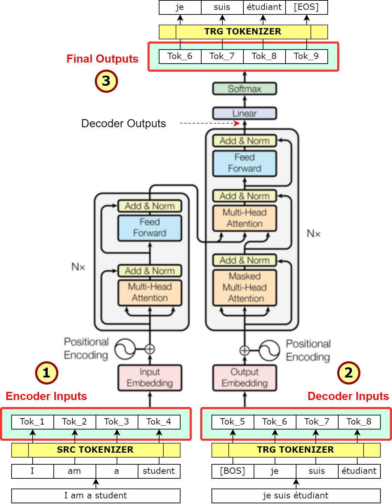

# T5

# 1. Introduction

🔗 논문 링크

[Exploring the Limits of Transfer Learning with a Unified...](https://arxiv.org/abs/1910.10683)

## T5의 특징

1. text-to-text framework

Text-to-Text는 보통 generation task에서 사용하는 방식인데, T5에서는 generation뿐만 아니라 classification, regression 문제도 Text-to-Text로 풀려고 했다. 이렇게 모든 task들을 하나의 접근 방법으로 풀게 된다면 **다양한** downstream task에 **동일한** model, objective, training procedure, decoding process를 적용할 수 있게 된다.

T5는 획일화된 방식을 통해 다양한 transfer learning objective와 unlabeled dataset 같은 다양한 모델링 요소들에 대해서 효과적으로 비교 분석할 수 있게 되었다.

1. denoising corrupted span

T5의 pre-training objective는 SpanBERT논문에서 제안된 기법을 사용한다. t5는 SpanBERT의 token 단위가 아닌 span 단위의 consecutive masking 개념만 사용하였다. ****

1. 대규모 사전 훈련 데이터셋 (C4)

전이 학습을 위한 중요한 요소는 사전 훈련에 사용되는 레이블이 없는 데이터셋이다.

wikipedia의 텍스트는 품질은 우수하나 스타일이 균일하고 상대적으로 작으며, Common crawl 웹 스크랩은 크고 다양하나 품질이 낮다.

이러한 요구 사항을 충족시키기 위해 wikipedia보다 2배 큰 common crawl 버전인 C4(Colossal Clean Crawled Corpus)를 개발. 여기에 중복 제거, 불완전한 문장 폐기, 불필요한 내용 제거를 통해 데이터 필터링을 하였다. 이러한 필터링을 통해 overfitting 없이, 더 나은 결과를 통해 모델 크기가 증가할 수 있었다. C4는 tensorflow datasets을 통해 제공된다.

1. original encoder-decoder transformer

T5의 model architecture는 기본 Transformer 구조를 크게 벗어나지 않는다. BERT나 GPT 같은 모델처럼 Transformer 구조의 Encoder나 Deocoder를 따로 떼어내서 사용하는 것이 아니라 그냥 원래 Transformer의 Encoder-Decoder 구조를 그대로 가져와서 사용한다. 다만 약간의 변경점은 있다.

- Transformer의 Layer Normalization에 사용되는 bias를 제거하고 rescale만 수행
- Absolute positional embedding 대신 Relative positional embedding 사용
- Model layer 전체에서 position embedding parameter sharing

1. Multi-task pre-training

Multi-task learning이란 하나의 unsupervised task에 대해서 pre-training을 진행한 후 fine-tuning하는 것 대신에 여러 종류의 task에 대해서 한 번에 training을 진행하는 것을 말한다.

논문에서는 이 multi-task learning 방식과 pre-train + fine-tune 방식의 성능 비교를 진행하고자 했다. Multi-task learning의 경우에는 각 task별 data 사용 비율에 따라 성능이 달라지게 되는데, 자칫 너무 많은 양의 data를 training에서 활용하게 된다면 training dataset을 memorize하게 된다. 그래서 논문에서는 여러가지 비율 설정 방식에 대해서 비교를 진행했다.

여러 실험들을 거친 후 T5 모델이 선택한 기법들은 다음과 같다.

- Span-corruption objective
- Longer pre-training (1 million steps on batch size 211)
- Larger model (11B parameters)
- Multi-task pre-training + fine-tuning
- Beam Search

## reference

[https://ai.googleblog.com/2020/02/exploring-transfer-learning-with-t5.html](https://ai.googleblog.com/2020/02/exploring-transfer-learning-with-t5.html)

[https://velog.io/@mooncy0421/Paper-Review-T5-Exploring-the-Limits-of-Transfer-Learning-with-a-Unified-Text-to-Text-Transformer](https://velog.io/@mooncy0421/Paper-Review-T5-Exploring-the-Limits-of-Transfer-Learning-with-a-Unified-Text-to-Text-Transformer)

# 2. Installation

NAME="Linux Mint"
VERSION="20.2 (Uma)"

library version file: env/environment.yaml

# 3. Run